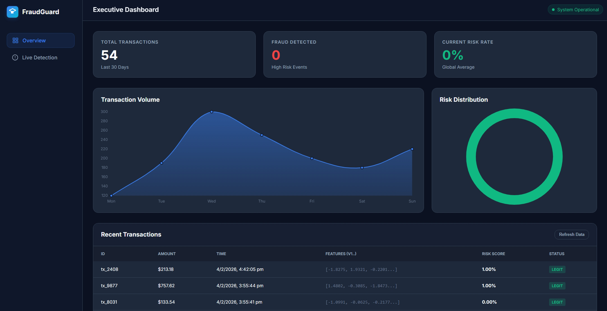
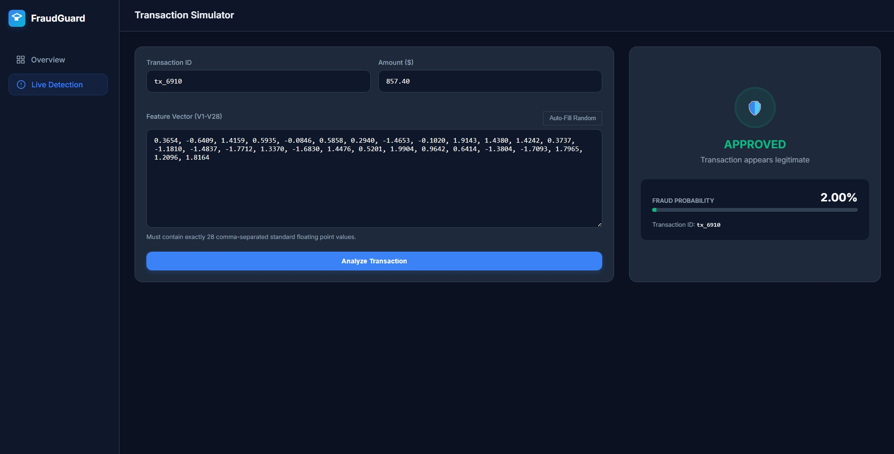

<h1 align="center">🚨 Real-Time Fraud Detection System</h1>

A Django + Machine Learning web application for real-time fraud detection, transaction risk analysis, and API-based inference.

---

  
  
  
  
  
  
  

---

## 🎥 Demo Preview

  

Executive dashboard showing transaction analytics and fraud risk distribution.

---

## 📸 Project Screenshots

### 🔹 Live Transaction Detection

  

### 🔹 Executive Dashboard

  

---

## 🧠 Project Overview

This project demonstrates real-world deployment of a Machine Learning fraud detection model inside a Django web application.

The system exposes REST APIs for real-time fraud prediction, processes transaction data through a trained ML model, and stores results for analytics and monitoring. The architecture simulates a production ML workflow including preprocessing, inference, persistence, and dashboard visualization.

The model is trained using the Kaggle Credit Card Fraud Detection dataset containing over 284,000 transactions.

---

## ⚙️ Tech Stack

| Layer | Technology |
|---|---|
| Backend | Django + Django REST Framework |
| Machine Learning | Scikit-learn (RandomForestClassifier) |
| Frontend | HTML, CSS, JavaScript |
| Database | PostgreSQL / SQLite |
| Deployment | Docker, Gunicorn |
| Version Control | Git & GitHub |

---

## 🚀 Features

- ✅ Real-time fraud prediction (<100ms inference)
- ✅ RandomForestClassifier ML model
- ✅ Handles class imbalance using `class_weight='balanced'`
- ✅ Feature scaling using RobustScaler
- ✅ REST API for transaction detection
- ✅ Transaction logging & persistence
- ✅ Executive analytics dashboard
- ✅ Dockerized deployment
- ✅ Modular ML pipeline

---

## 📂 Project Structure

real-time-fraud-detection/
├── fraud_backend/
│ ├── settings.py
│ ├── urls.py
│ └── wsgi.py
│
├── transactions/
│ ├── models.py
│ ├── views.py
│ ├── serializers.py
│ └── ml_utils.py
│
├── ml_engine/
│ ├── train_model.py
│ └── fraud_model.pkl
│
├── frontend/
│ ├── index.html
│ ├── dashboard.js
│ └── styles.css
│
├── screenshots/
├── Dockerfile
├── docker-compose.yml
├── requirements.txt
└── manage.py
